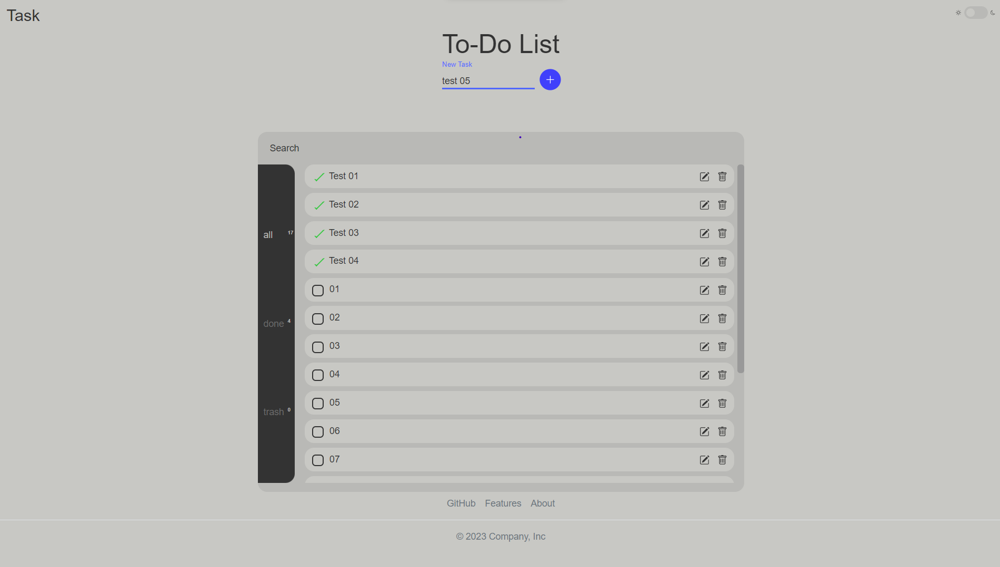
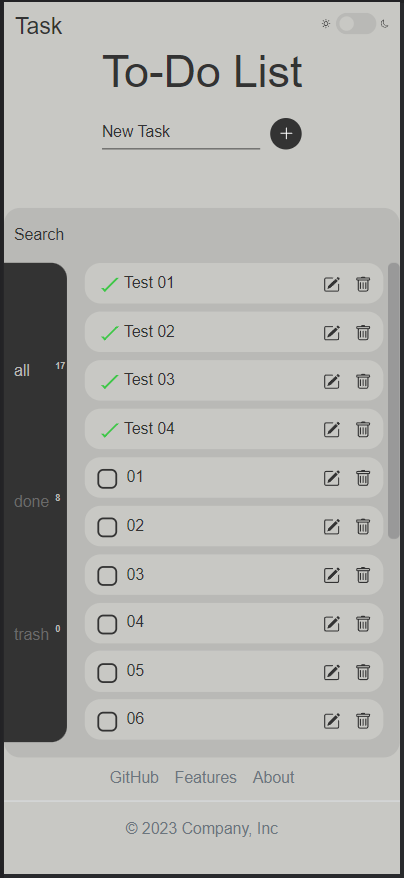
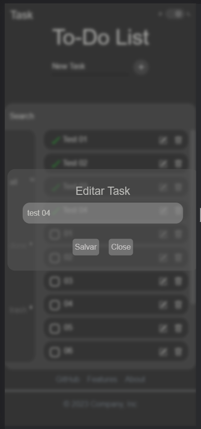

# Projeto: To-Do List
Este é um projeto de uma aplicação To-Do List simples, desenvolvida em HTML, CSS e JavaScript. A aplicação permite que o usuário crie, edite, marque como concluída e mova tarefas para a lixeira. Além disso, as tarefas são armazenadas localmente no navegador utilizando o LocalStorage.

 
 

Página Web da To Do List no modo light.

 

## Funcionalidades
- Adicionar uma nova tarefa: O usuário pode adicionar uma nova tarefa fornecendo um título e pressionando a tecla "Enter" ou clicando no botão de adicionar.

- Editar uma tarefa: O usuário pode editar o título de uma tarefa existente clicando no ícone de edição ao lado da tarefa.

- Marcar tarefa como concluída: O usuário pode marcar uma tarefa como concluída clicando na caixa de seleção ao lado do título da tarefa.

- Mover tarefa para a lixeira: O usuário pode mover uma tarefa para a lixeira clicando no ícone de lixeira ao lado da tarefa. As tarefas na lixeira podem ser restauradas ou permanentemente removidas.

- Armazenamento local: As tarefas são armazenadas localmente no navegador utilizando o LocalStorage, permitindo que as tarefas persistam mesmo após a atualização ou fechamento da página.

 

    
O projeto também foi desenvolvido com foco na responsividade, garantindo uma experiência otimizada tanto em dispositivos móveis quanto em desktops.

- ## Tecnologias Utilizadas

> - HTML
> - CSS
> - JavaScript

 

## Como usar

- link: https://jhonheldher.github.io/To-Do-List/

1. Clone ou faça o download deste repositório para o seu computador.

2. Abra o arquivo index.html em um navegador da web.

3. A aplicação To-Do List será carregada e você poderá começar a adicionar, editar, concluír e excluir.

## Contribuição
Contribuições são bem-vindas! Se você tiver alguma melhoria, correção de bugs ou novos recursos para adicionar, sinta-se à vontade para abrir uma issue ou enviar um pull request.

## Licença
Este projeto está licenciado sob a MIT License. Sinta-se livre para usar, modificar e distribuir este projeto de acordo com os termos da licença.

